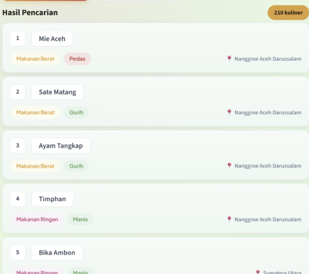
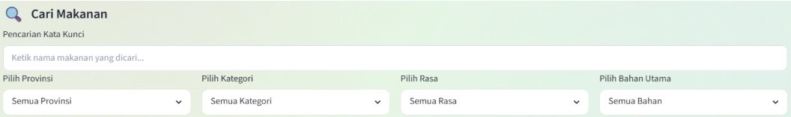
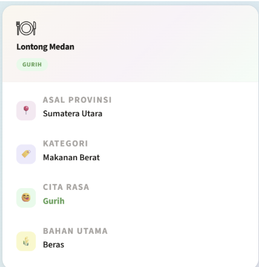
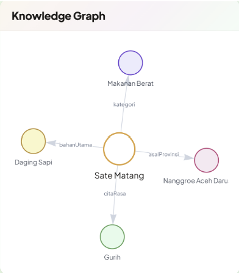
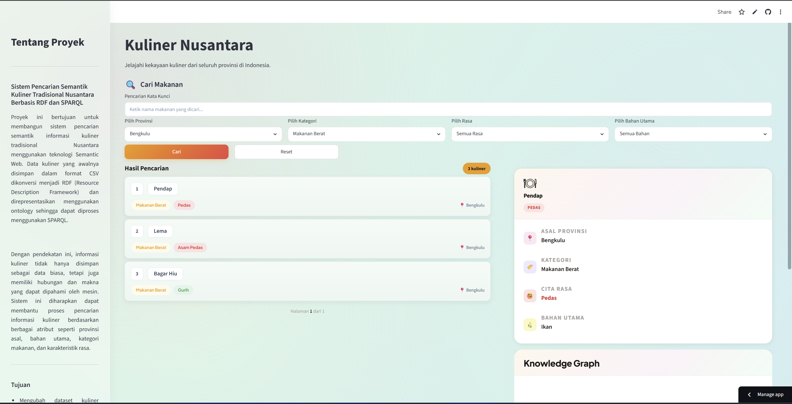

# Sistem Pencarian Semantik Kuliner Tradisional Nusantara Berbasis RDF dan SPARQL

## Akses Aplikasi

Aplikasi dapat diakses secara online melalui:

🔗 https://kulinernusantarasemanticweb.streamlit.app/

## Deskripsi Proyek

Proyek ini bertujuan untuk membangun sistem pencarian semantik informasi kuliner tradisional Nusantara menggunakan teknologi Semantic Web. Data kuliner yang awalnya disimpan dalam format CSV dikonversi menjadi RDF (Resource Description Framework) dan direpresentasikan menggunakan ontology sehingga dapat diproses menggunakan SPARQL.

Dengan pendekatan ini, informasi kuliner tidak hanya disimpan sebagai data biasa, tetapi juga memiliki hubungan dan makna yang dapat dipahami oleh mesin. Sistem ini diharapkan dapat membantu proses pencarian informasi kuliner berdasarkan berbagai atribut seperti provinsi asal, bahan utama, kategori makanan, dan karakteristik rasa.

## Tujuan

* Mengubah dataset kuliner tradisional Nusantara dari format CSV ke RDF Turtle (.ttl).
* Membangun ontology untuk merepresentasikan konsep dan hubungan dalam domain kuliner.
* Menghasilkan representasi ontology dalam format RDF/XML.
* Menyimpan dan mengelola data RDF menggunakan Apache Jena Fuseki.
* Menyediakan fasilitas pencarian informasi menggunakan query SPARQL.

## Anggota Kelompok

| Nama                           | NPM          |
| ------------------------------ | ------------ |
| Marchellin Chenika             | 140810230002 |
| Audrey Shaina Tjandra          | 140810230026 |
| Siti Nailah Eko Putri Alawiyah | 140810230059 |

## Struktur Proyek

```text
Kuliner_Nusantara_SemanticWeb/
│
├── app/
├── data/
│   ├── raw/
│   ├── rdf/
│   └── ontology/
│
├── scripts/
├── sparql/
├── document/
│
├── README.md
└── requirements.txt
```

## Penjelasan Folder

### data/raw

Menyimpan dataset kuliner tradisional Nusantara dalam format CSV sebagai sumber data utama.

### data/rdf

Menyimpan hasil konversi dataset ke format RDF Turtle (.ttl).

### data/ontology

Menyimpan ontology domain kuliner dalam format Turtle (.ttl) dan RDF/XML (.rdf).

### scripts

Berisi program Python yang digunakan untuk proses konversi data dan pembuatan ontology.

### sparql

Berisi kumpulan query SPARQL yang digunakan untuk mengakses dan mengambil informasi dari dataset RDF.

### app

Berisi aplikasi berbasis Streamlit yang digunakan sebagai antarmuka pengguna untuk melakukan pencarian informasi kuliner tradisional Nusantara. Aplikasi akan terhubung dengan Apache Jena Fuseki melalui query SPARQL untuk menampilkan hasil pencarian secara interaktif.

### document

Berisi dokumentasi proyek, laporan, dan kebutuhan pendukung lainnya.

## Alur Pengolahan Data

Dataset CSV
→ Konversi ke RDF Turtle (.ttl)
→ Pembuatan Ontology
→ Konversi ke RDF/XML
→ Penyimpanan pada Apache Jena Fuseki
→ Query menggunakan SPARQL
→ Visualisasi melalui aplikasi

## Teknologi yang Digunakan

* Python
* RDF (Resource Description Framework)
* Turtle (.ttl)
* OWL Ontology
* RDF/XML
* Apache Jena Fuseki
* SPARQL
* Streamlit


## Panduan Instalasi dan Menjalankan Aplikasi

### 1. Clone Repository

```bash
git clone https://github.com/MarchellinC/Kuliner_Nusantara_SemanticWeb.git
cd Kuliner_Nusantara_SemanticWeb
```

### 2. Buat dan Aktifkan Virtual Environment (Opsional)

Buat virtual environment:

```bash
python -m venv venv
```

Aktifkan virtual environment pada Windows PowerShell:

```powershell
.\venv\Scripts\Activate.ps1
```

### 3. Install Dependencies

```bash
pip install -r requirements.txt
```

Isi file `requirements.txt`:

```txt
streamlit
pandas
SPARQLWrapper
plotly
```

### 4. Jalankan Apache Jena Fuseki

Pastikan Apache Jena Fuseki telah terinstal pada sistem.

Masuk ke direktori Apache Jena Fuseki:

```bash
cd apache-jena-fuseki-<versi>
```

Jalankan Fuseki menggunakan perintah:

```bash
.\fuseki-server.bat
```

atau

```bash
fuseki-server.bat
```

Setelah Fuseki berhasil dijalankan, buka browser dan akses:

```text
http://localhost:3030
```

Buat dataset baru dengan nama:

```text
kuliner
```

Kemudian upload file RDF Turtle yang tersedia pada repository:

```text
data/rdf/kuliner_nusantara.ttl
```

Setelah proses upload selesai, endpoint SPARQL yang digunakan oleh aplikasi akan tersedia pada:

```text
http://localhost:3030/kuliner/query
```

Pastikan endpoint tersebut dapat diakses sebelum menjalankan aplikasi Streamlit.


### 5. Menjalankan Aplikasi Streamlit

Dari direktori utama proyek jalankan:

```bash
python -m streamlit run app/app.py
```

atau

```bash
streamlit run app/app.py
```

### 6. Akses Aplikasi

Buka browser dan akses:

```text
http://localhost:8501
```

### 7. Menggunakan Light Mode

Untuk mendapatkan tampilan yang sesuai dengan desain aplikasi, gunakan tema **Light Mode** pada Streamlit.

Jika aplikasi terbuka dalam Dark Mode:

1. Klik **⋮** pada pojok kanan atas.
2. Pilih **Settings**.
3. Ubah **Theme** menjadi **Light**.


## Panduan Penggunaan Website

Setelah aplikasi berhasil dijalankan, Anda dapat menggunakan fitur-fitur yang tersedia dengan mengikuti langkah-langkah berikut.

### 1. Buka Website

Akses aplikasi melalui browser menggunakan salah satu alamat berikut:

* **Online Demo:** https://kulinernusantarasemanticweb.streamlit.app/
* **Local:** http://localhost:8501

### 2. Baca Informasi Proyek

Pada bagian **sidebar** terdapat informasi singkat mengenai proyek beserta teknologi yang digunakan. Pengguna juga dapat melihat statistik dataset yang digunakan pada aplikasi.

### 3. Jelajahi Daftar Kuliner

Saat aplikasi pertama kali dibuka, akan ditampilkan daftar berbagai kuliner tradisional Nusantara dalam bentuk **card**.


### 4. Gunakan Pencarian dan Filter

Pengguna dapat mencari makanan tertentu menggunakan kolom pencarian atau mengombinasikan beberapa filter berikut:

* **Provinsi** → mencari makanan berdasarkan daerah asal.
* **Kategori** → memilih jenis hidangan.
* **Rasa** → mencari makanan berdasarkan cita rasa.
* **Bahan Utama** → mencari makanan berdasarkan bahan dominan.


### 5. Cari atau Reset

* Klik **Cari** untuk menampilkan hasil sesuai filter yang dipilih.
* Klik **Reset** untuk menghapus seluruh filter dan menampilkan kembali seluruh data kuliner.

### 6. Lihat Detail Makanan

Klik salah satu **card makanan** pada hasil pencarian untuk menampilkan informasi lengkap yang meliputi:

* Nama makanan
* Provinsi asal
* Kategori
* Cita rasa
* Bahan utama



### 7. Lihat Knowledge Graph

Di bawah panel detail akan ditampilkan **Knowledge Graph** interaktif yang menggambarkan hubungan antara makanan dengan provinsi asal, kategori, cita rasa, dan bahan utama berdasarkan RDF Knowledge Graph yang tersimpan pada Apache Jena Fuseki.




## Contoh Hasil Pencarian

Berikut merupakan contoh tampilan aplikasi setelah pengguna melakukan pencarian. Pengguna dapat melihat daftar hasil pencarian pada sisi kiri, informasi detail makanan pada sisi kanan, serta visualisasi Knowledge Graph yang menggambarkan hubungan antara makanan dengan provinsi asal, kategori, cita rasa, dan bahan utama.
